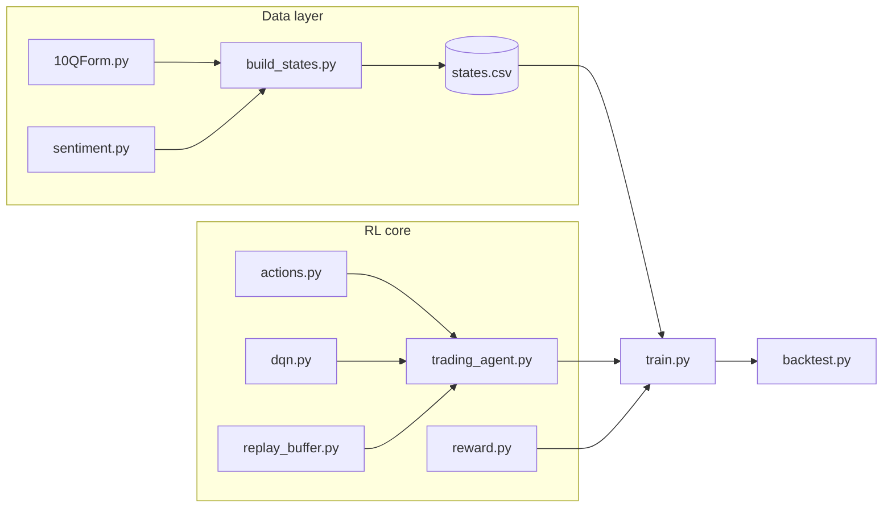

# q-for-10q

A Deep Q-Network (DQN) trading agent that reads quarterly 10-Q filings and learns to make buy, hold, or sell decisions. The neural network is written from scratch in NumPy: no prepackaged models implemented.

## 1. Overview of the problem

Every public company in the US files a 10-Q report with the SEC each quarter. These filings contain the company's financial statements plus a narrative section, Management's Discussion and Analysis (MD&A), where management explains how the quarter went. The question this project asks: can a reinforcement learning agent read each new 10-Q and learn a profitable trading policy from it?

We frame this as a Markov decision process:

- **State**: an 11-dimensional vector summarizing one stock-quarter. Five features come from the filing's financials (revenue growth, net margin, operating cash flow over revenue, liabilities over assets, EPS change year over year), four from market data (trailing quarterly return, daily volatility, volume change, 12-month momentum), and two from the MD&A text (a sentiment scalar produced by a sentence-transformers model, and its change versus the prior quarter).
- **Actions**: sell, hold, or buy. An action sets the target position (-1 short, 0 flat, +1 long) held until the next filing.
- **Reward**: the position times the log return of the stock from this filing to the next, minus transaction costs on position changes. Log returns add across quarters, so maximizing total reward is the same as maximizing compounded portfolio growth.

The agent is a standard DQN (Mnih et al. 2015, https://web.stanford.edu/class/psych209/Readings/MnihEtAlHassibis15NatureControlDeepRL.pdf): a small feedforward Q-network with experience replay, epsilon-greedy exploration, and a periodically synced target network. Every piece of the network, including backpropagation, is implemented directly in NumPy.

A key design decision throughout: everything is aligned to the **filing date**, not the quarter end. A 10-Q becomes public roughly five weeks after the quarter closes, so pairing its contents with quarter-end prices would give the agent information the market did not have yet. Market features only use data up to the filing date, and trades execute at the first close on or after it. The backtest is similarly walk-forward: the agent trains only on the earlier part of history and is evaluated greedily on a held-out later period it has never seen.

## 2. Environment setup

The project was developed with Python 3.11. Any 3.10+ should work.

```bash
# clone and enter the repo
git clone https://github.com/sophiaray21/q-for-10q.git
cd q-for-10q

# create and activate a virtual environment
python3 -m venv .venv
source .venv/bin/activate        # on Windows: .venv\Scripts\activate

# install dependencies
pip install -r requirements.txt
```

Dependencies (see `requirements.txt`): `numpy`, `pandas`, `requests`, `yfinance`, `lxml`, `beautifulsoup4`, `sentence-transformers`.

Two things happen automatically on first run and need a network connection:

- The sentence-transformers model (`all-MiniLM-L6-v2`, about 80 MB) downloads from HuggingFace the first time sentiment is computed, then loads from the local cache.
- Filings and price history download from the SEC and Yahoo Finance. The SEC requires a descriptive User-Agent on API requests, so pass your name and email to `build_states.py` (see below). No API keys are needed; all data sources are free.

## 3. Reproducing the results

### Step 1: build the dataset

```bash
python3 build_states.py --tickers AAPL MSFT JPM --limit 12 \
    --name "Your Name" --email you@example.com --out states.csv
```

This downloads the 10-Q filings, fetches financials from the SEC XBRL API and prices from yfinance, scores each filing's MD&A with the sentiment model, and writes `states.csv` with one row per stock-quarter (columns: `ticker`, `quarter_end`, `close`, `f0`..`f10`). It also writes `sentiment_cache.csv` so reruns skip the expensive embedding step, and saves the raw filings under `filings/`.

The first run takes a minute or two (model download plus about 30 filings to fetch and embed). Cached reruns take a few seconds.

### Step 2: train

```bash
python3 train.py states.csv
```

Trains the DQN for 30 epochs over the dataset and saves the weights to `dqn_weights.npz`. Total reward per epoch should clearly trend upward.

### Step 3: backtest

```bash
python3 backtest.py states.csv
```

Performs a walk-forward evaluation: trains on the earliest 70% of each stock's history, then runs the agent greedily on the held-out 30% and compares against buy-and-hold and random baselines. Reference output from our run (June 2026 data):

```
out-of-sample results (the held-out 30%, never seen in training):
  dqn (greedy)  total   +67.3%   avg/qtr +0.0858   max drawdown -11.0%   win rate 50%
  buy and hold  total   +48.0%   avg/qtr +0.0653   max drawdown -21.3%   win rate 50%
  random        total    -9.1%   avg/qtr -0.0159   max drawdown -27.4%   win rate 33%
```

All random seeds are fixed, so given the same `states.csv` the training and backtest numbers reproduce exactly. Your `states.csv` may differ slightly from ours because the data sources move: new filings appear over time and yfinance price history extends daily. Treat the numbers above as a reference run, not a benchmark; with only a handful of held-out stock-quarters the comparison demonstrates the pipeline, not statistical significance.

### Module smoke tests

Each core module runs a self-check when executed directly, with no data files needed:

```bash
python3 reward.py          # reward math sanity checks
python3 replay_buffer.py   # buffer capacity and sampling shapes
python3 dqn.py             # numerical vs analytic gradient check
python3 trading_agent.py   # learns a planted pattern from scratch
python3 sentiment.py       # sentiment axis sanity check (downloads model on first run)
python3 train.py           # full training loop on synthetic placeholder data
python3 backtest.py        # full backtest on synthetic placeholder data
```

## 4. Code organization

The project has three layers: data collection, the RL core, and training/evaluation.



### Data layer

| File | Role |
|------|------|
| `10QForm.py` | SEC EDGAR plumbing: ticker to CIK lookup, listing a company's 10-Q filings, building document URLs, downloading filings |
| `getStockInfo.py` | Minimal yfinance price fetch (early prototype; `build_states.py` fetches its own history) |
| `sentiment.py` | Extracts the MD&A section from a filing's HTML and scores it with sentence embeddings. Each sentence is compared against positive and negative anchor sentences written in filing language; the average similarity difference, squashed to (-1, 1), is the sentiment feature |
| `build_states.py` | The dataset builder. Wrangles SEC XBRL financials, yfinance market data, and MD&A sentiment into one row per stock-quarter and writes `states.csv`. Handles XBRL tag fallbacks across companies and eras, recovers quarterly values from year-to-date windows, and z-scores features using only the training portion of history |

### RL core

| File | Role |
|------|------|
| `actions.py` | Single source of truth for the action space: SELL/HOLD/BUY ids, the action-to-position map, and helpers. Documents the position semantics |
| `dqn.py` | The Q-network in pure NumPy: He initialization, ReLU forward pass, backprop with MSE loss on the taken action only, plus a numerical gradient check |
| `replay_buffer.py` | Fixed-capacity experience replay with uniform random minibatch sampling |
| `reward.py` | Reward function: position times next-quarter log return, minus transaction cost on position changes |
| `trading_agent.py` | Ties the pieces together: epsilon-greedy policy with decay, target network synced every N steps, TD-target training step |

### Training and evaluation

| File | Role |
|------|------|
| `train.py` | Main training loop. Episodes are one stock's quarters in chronological order. Falls back to synthetic placeholder data (with a learnable planted pattern) when run without a csv |
| `backtest.py` | Walk-forward evaluation against buy-and-hold and random baselines, with total return, average per-quarter reward, max drawdown, and win rate |

### Generated artifacts (gitignored)

`states.csv` (the dataset), `sentiment_cache.csv` (sentiment scores keyed by filing accession number), `filings/` (downloaded 10-Q documents), `dqn_weights.npz` (trained network weights).
